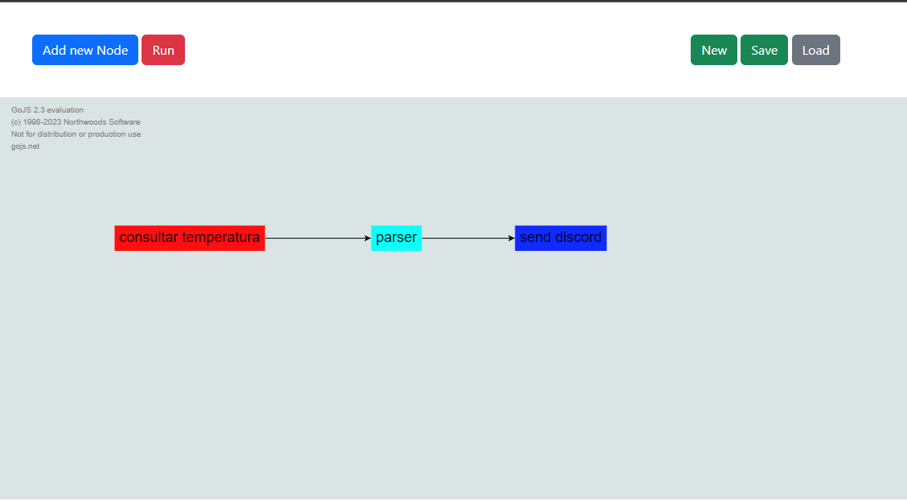
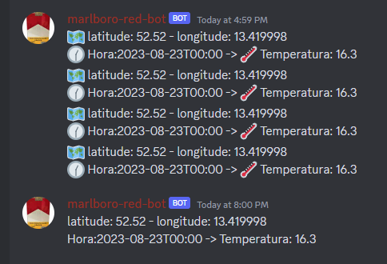

# MVP to test FlowChart to execute tasks


<br>


## Criação de .env
* An .env file must be created in the root of the project, using the '.env-example' file as a reference
```env
DATABASE_URI = 'mysql://USUARIO_BANCO:SENHA_BANCO@IP/NOME_BANCO'
USER_ADM = ''
USER_ADM_PASSWORD = ''
```


### Unit testing
```bash
python3 -m pytest --cov-config=.coveragerc --cov-report html --cov=. main/
```

## Linux 🐧
Install all dependencies
```bash
python3 -m venv venv
source venv/bin/activate
pip install -r requirements.txt
```

## Optional - In case of error with Mysqlclient
```bash
sudo apt-get install python3-dev default-libmysqlclient-dev build-essential
```

## Optional - Execute Worker
```bash
python3 main/helpers/worker.py
```

## Execute
```bash
python3 -m flask --app main --debug run
```
