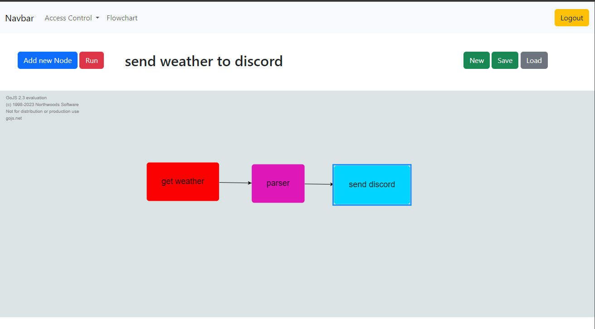

# MVP to test FlowChart to execute tasks


<br>


## Criação de .env
* An .env file must be created in the root of the project, using the '.env-example' file as a reference
```env
DATABASE_URI = 'mysql://USUARIO_BANCO:SENHA_BANCO@IP/NOME_BANCO'
USER_ADM = ''
USER_ADM_PASSWORD = ''
```


### Unit testing
```bash
python -m pytest --cov-config=.coveragerc --cov-report html --cov=. main/
```
